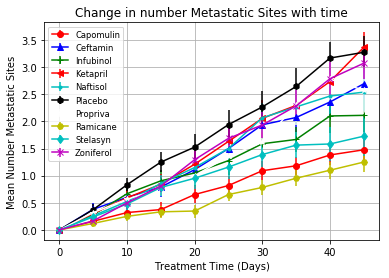
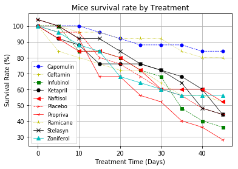
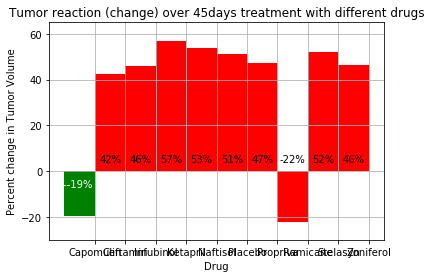

The Power of Plots

## Background

What good is data without a good plot to tell the story?

Here is an application of some Python Matplotlib concepts learned on real-world situations. For this challenge data from  Pymaceuticals Inc research was cinsidered

Pymaceuticals Inc.is a burgeoning pharmaceutical company based out of San Diego, CA. Pymaceuticals specializes in drug-based, anti-cancer pharmaceuticals. In their most recent efforts, they've since begun screening for potential treatments to squamous cell carcinoma (SCC), a commonly occurring form of skin cancer.

Data for this project include Pymaceuticals Inc's most recent animal study. In this study, 250 mice were treated through a variety of drug regimes over the course of 45 days. Their physiological responses were then monitored over the course of that time. Our objective was to analyze the data to show how four treatments (Capomulin, Infubinol, Ketapril, and Placebo) compare.

This task was done by:

* Creating a scatter plot that shows how the tumor volume changes over time for each treatment as seen on

* Creating a scatter plot that shows how the number of metastatic(https://en.wikipedia.org/wiki/Metastasis) (cancer spreading) sites changes over time for each treatment as seen in 

* Creating a scatter plot that shows the number of mice still alive through the course of treatment (Survival Rate)  

* Creating a bar graph that compares the total % tumor volume change for each drug across the full 45 days. 

The following dependencies were considered:

* Pandas Library and the Jupyter Notebook.
* Matplotlib library.

## Copyright

Data Boot Camp © 2019. All Rights Reserved.
